Taller Sentencias CRUD – DDL y DML

Gestión de una Biblioteca

Contexto del Negocio:

Imagina que eres el administrador de una biblioteca y necesitas gestionar la
información de los libros, autores y los préstamos realizados. Necesitarás crear y
manipular tablas en una base de datos para mantener un registro de esta
información.

Parte 1: Creación de la Base de Datos y Tablas

1. Crea una base de datos llamada Biblioteca.
2. Dentro de la base de datos Biblioteca, crea una tabla Autores con las
siguientes columnas:

o AutorID: entero, clave primaria, auto incrementable.
o Nombre: cadena de caracteres de hasta 50 caracteres.
o Apellido: cadena de caracteres de hasta 50 caracteres.
o Nacionalidad: cadena de caracteres de hasta 50 caracteres.

3. Crea una tabla Libros con las siguientes columnas:

o LibroID: entero, clave primaria, auto incrementable.
o Titulo: cadena de caracteres de hasta 100 caracteres.
o Genero: cadena de caracteres de hasta 50 caracteres.
o AutorID: entero, clave foránea referenciando AutorID en la tabla
Autores.
o AñoPublicacion: entero.

4. Crea una tabla Prestamos con las siguientes columnas:

o PrestamoID: entero, clave primaria, auto incrementable.
o LibroID: entero, clave foránea referenciando LibroID en la tabla
Libros.

o FechaPrestamo: fecha.
o FechaDevolucion: fecha.
o NombreUsuario: cadena de caracteres de hasta 50 caracteres.

Parte 2: Inserción de Datos

1. Inserta autores en la tabla Autores
2. Inserta libros en la tabla Libros
3. Inserta préstamos en la tabla Prestamos

Parte 3: Consultas y Manipulación de Datos

1. Realiza una consulta para listar todos los libros
2. Realiza una consulta para encontrar todos los préstamos no devueltos
3. Actualiza el nombre de un usuario
4. Elimina un libro de la tabla Libros

Parte 4: Modificación de la Estructura de las Tablas

1. Añade una columna 'Editorial' a la tabla Libros.
2. Cambia el nombre de la tabla Autores a Escritores.

Parte 5: Otros 😊

1. Añade un nuevo autor llamado "Julio Cortázar" con nacionalidad
"Argentina".
2. Añade un nuevo libro titulado "Rayuela" (Género: Novela, AñoPublicacion:
1963) escrito por Julio Cortázar.
3. Registra un nuevo préstamo del libro "Rayuela" realizado por "Lucía
Fernández" desde el 15 de julio de 2024 hasta el 29 de julio de 2024.

# SOLUCIÓN TALLER:

## Parte 1 - Creación Base de Datos y Tablas:

1. Creación de la base de datos biblioteca:

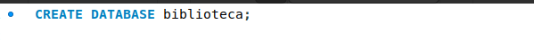

2. Creación tabla autores:

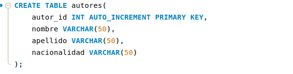

3. Creación tabla libros:

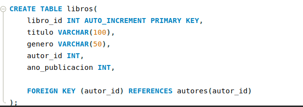

4. Creación tabla prestamos:

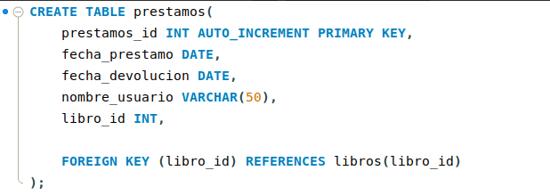

## Parte 2 - Inserción de Datos:

1. Insertar datos en las tablas:

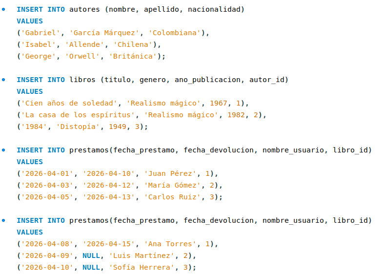

## Parte 3 - Consultas y Manipulación de Datos

1. Listado de libros:

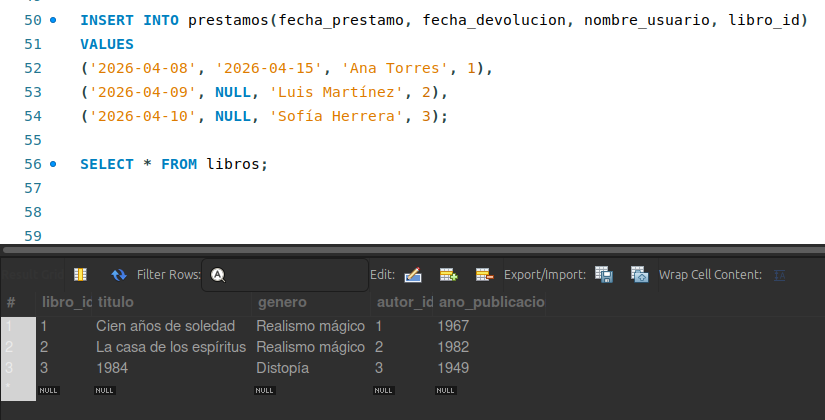

2. Prestamos no devueltos:

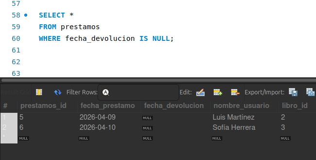

3. Actualizar nombre de un usuario:
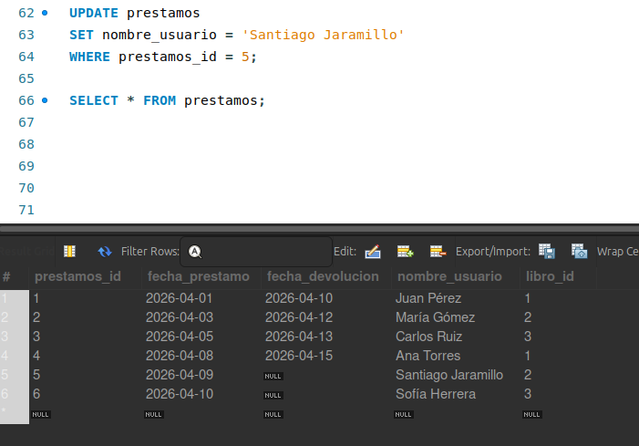

4. Eliminación de un libro:

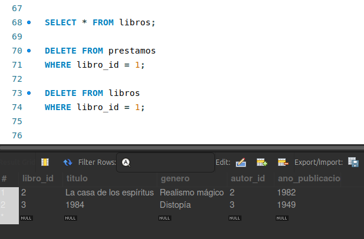

## Parte 4 - Modificación de la Estructura de las Tablas

5. Añadir columna Editorial a la tabla Libros:

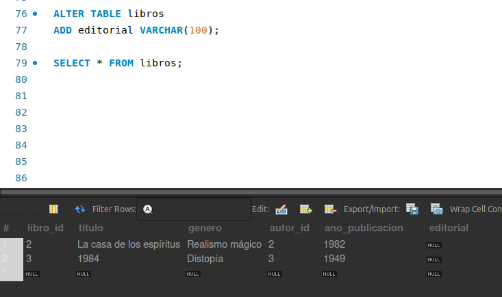

6. Cambiar el nombre de la tabla Autores:

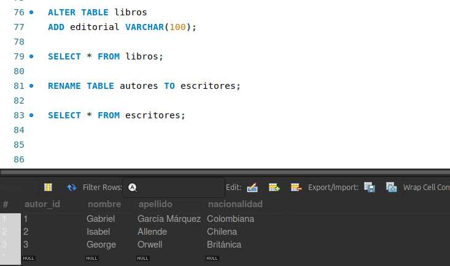

Al cambiar el nombre de la tabla se requiere configurar la relación que hay con la tabla libros:

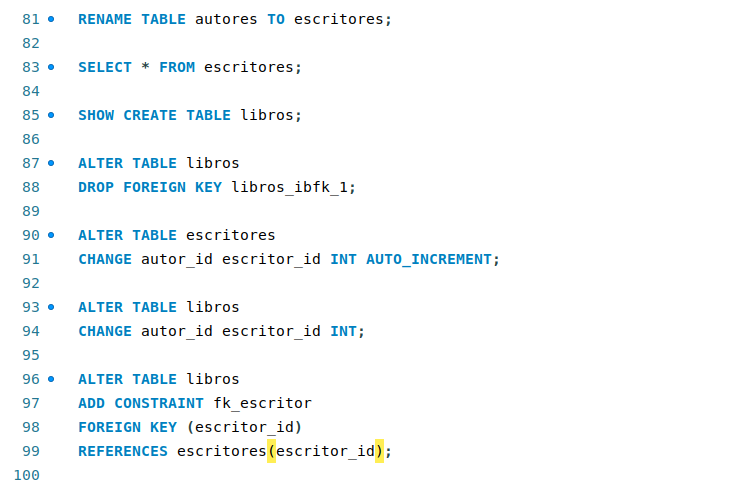

## Parte 5 - Otros

1. Agregar un nuevo escritor:

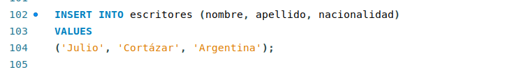

2. Agregar un nuevo libro:

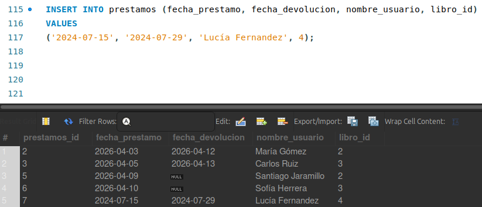

